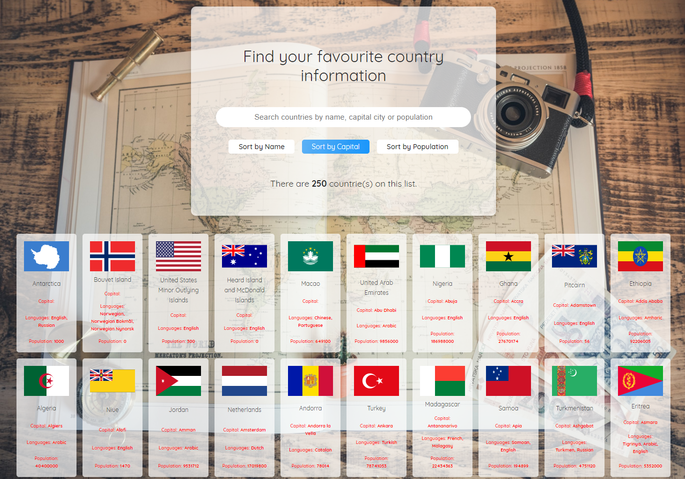

# Developing an interactive Country information finder App

This app is developed as part of my 6 months coding bootcamp at Integrify Helsinki. It is about searching any country information on the list with an on the fly search results with statistics functionality. You can either search by sorting the name of the country, by capital city or by population size. The statistics functionality is made up of charts of top 10 most populous countries and top 10 most spoken languages. I have implemented the project using javaScript and DOM manipulation techniques. All functionalities was completed with ONLY Vanilla JavaScript. Happy Coding 😀.

## Demo

You can see the live demo of the App here:

[(https://sulaymon333.github.io/country-information-finder-with-statistics/)](https://sulaymon333.github.io/country-information-finder-with-statistics/)

# 

## Author

Sulaymon Tajudeen. [Learn More](https://sulaymontajudeen.com/)

## Technologies

- HTML
- CSS
- javaScript (Vanilla)

## License

This project is licensed under the MIT License - see the [LICENSE.md](./LICENSE.md) file for details.
